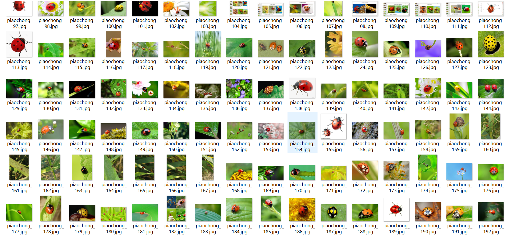
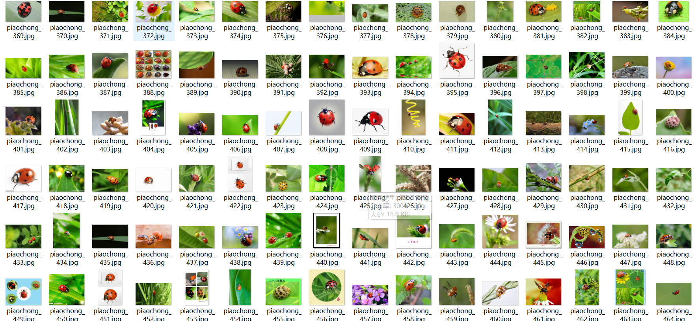

# Ladybug Detection Dataset 564 images VOC+YOLO format

The dataset is in Pascal VOC format with the addition of YOLO format (without split path txt files, only including jpg images along with their corresponding VOC xml files and YOLO txt files).

Number of images (jpg file count): 564

Number of annotations (xml file count): 564

Number of annotations (txt file count): 564

Number of annotation categories: 1

Annotation category names: ["ladybugs"]

Number of boxes per category:

- Number of ladybugs boxes = 792
- Total number of boxes = 792

Annotation tool used: labelImg

Annotation rules: draw boxes around the categories.

Important notes: The images were scraped from web sources and are self-organized for annotation; they are original works and should not be reused without permission.

## Images

---

Here is a pay link on Stripe (https://buy.stripe.com/3cs8yP7sY87d0vu9AB). Please contact me lonlonago@foxmail.com after funding $89, and I will send you a complete data files, thank you!

